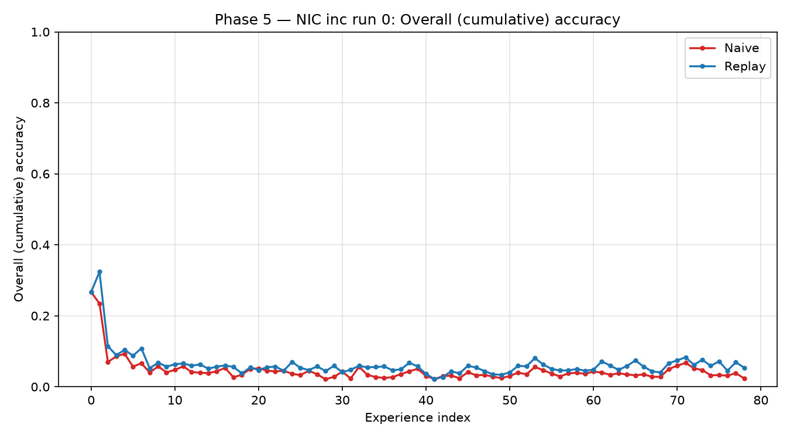
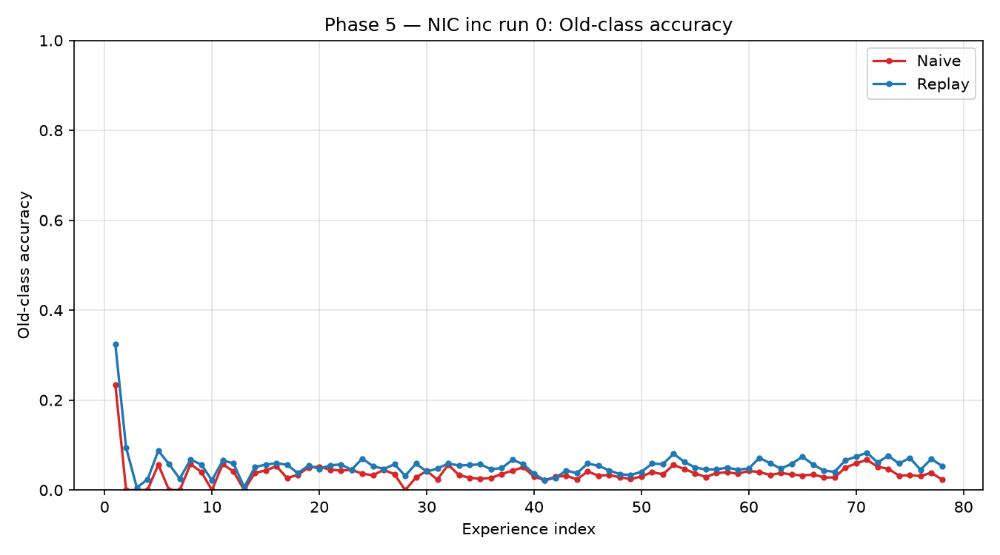
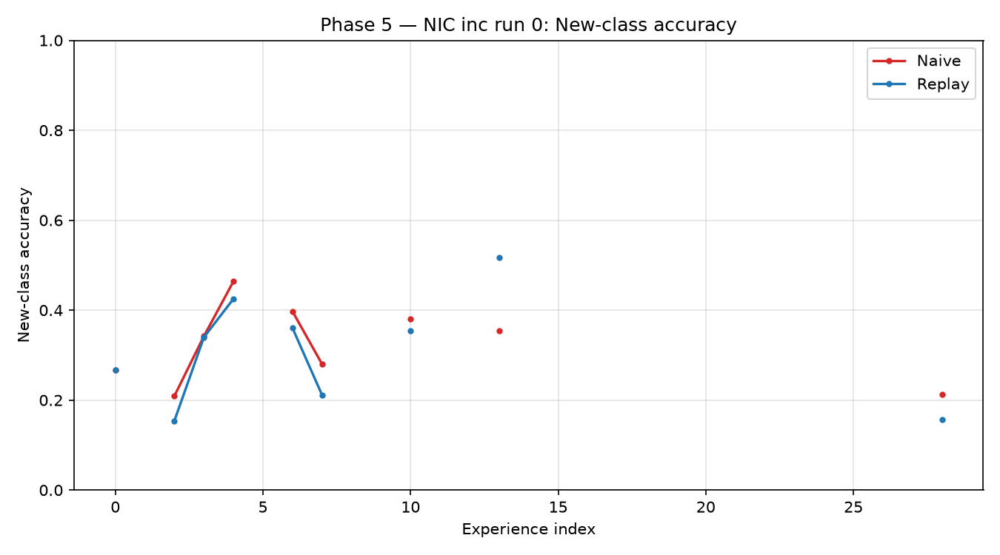
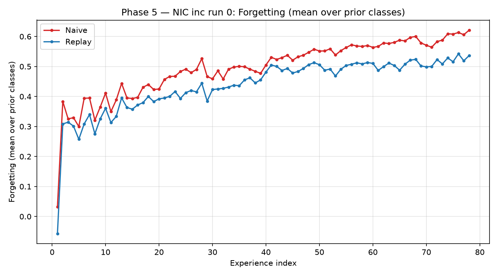

# Phase 5 — Main NIC Continual Experiment: Naive vs Experience Replay

## 1. Experiment

| Setting | Value |
|---|---|
| Dataset | CORe50 |
| Scenario / variant / run | NIC / inc / 0 |
| Experiences (official order) | 79 |
| Training samples (total) | 119,894 |
| Evaluation samples (fixed, sessions [3, 7, 10]) | 44,972 |
| Model | SmallConvNet (width 32, 64x64 input) |
| Device | cpu |
| Seed | 42 |

## 2. Configuration and fairness

Both methods start from ONE shared initial model state (`models\continual\phase5_nic/shared/initial_model_state.pt`, checksum recorded), train in the identical official order with identical architecture and hyperparameters, and are evaluated on the same fixed test set after every experience. The ONLY difference is the replay section:

| Setting | Naive | Replay |
|---|---|---|
| Replay memory | none | FIFO, capacity 2000 training references |
| Replay batch per step | - | 16 |
| Everything else (epochs 3, batch 64, lr 0.001, adam, seed 42, image 64px, width 32) | identical | identical |

Documented deviation from Phase-4 generic defaults: `training.epochs` is 3 (Phase-4 default was 1); `evaluation.batch_size` is an evaluation-only setting.

## 3. Metric definitions

- overall = micro top-1 accuracy over evaluation samples whose class has been introduced up to that experience; full = over all evaluation classes; old = over classes seen before the experience (null at experience 0); new = over classes introduced by the experience (null when none).
- forgetting(c, t) = max{acc(c, t') : t' < t} - acc(c, t); the aggregate at experience t is the mean over every class that has a prior measurement. The first experience has no prior measurement (null / N-A). Negative values (a class improved on its previous best) are preserved.
- average incremental accuracy = the mean, over all experiences, of the overall (cumulative-classes) accuracy measured after each experience.
- Evaluation never touches training; replay memory stores only official training references from already-completed experiences.

## 4. Results

### 4.1 Final comparison (after experience 79)

| Metric | Naive | Replay |
|---|---|---|
| Overall (cumulative) accuracy | 0.0235 | 0.0538 |
| Full-set accuracy (all 50 classes) | 0.0235 | 0.0538 |
| Old-class accuracy | 0.0235 | 0.0538 |
| Final mean forgetting (lower is better) | 0.6209 | 0.5364 |
| Average incremental accuracy (mean over all experiences) | 0.0458 | 0.0632 |
| Training time (sum of experiences, s) | 2258.24 | 5387.215 |

**Measured result.** Final cumulative accuracy: replay 0.0538 versus naive 0.0235 (difference +0.0303). Final mean forgetting: replay 0.5364 versus naive 0.6209 (difference -0.0845; lower is better). Average incremental accuracy: replay 0.0632 versus naive 0.0458 (difference +0.0174).

### 4.2 Milestone experiences

| Exp | Naive overall | Replay overall | Naive old | Replay old | Naive new | Replay new | Naive forget | Replay forget |
|---|---|---|---|---|---|---|---|---|
| 0 | 26.7% | 26.7% | N-A | N-A | 26.7% | 26.7% | N-A | N-A |
| 9 | 4.1% | 5.7% | 4.1% | 5.7% | N-A | N-A | 36.5% | 32.6% |
| 19 | 5.0% | 5.4% | 5.0% | 5.4% | N-A | N-A | 42.3% | 38.3% |
| 29 | 2.8% | 5.9% | 2.8% | 5.9% | N-A | N-A | 46.7% | 38.5% |
| 39 | 5.1% | 5.7% | 5.1% | 5.7% | N-A | N-A | 47.7% | 45.5% |
| 49 | 2.4% | 3.4% | 2.4% | 3.4% | N-A | N-A | 55.8% | 51.3% |
| 59 | 3.6% | 4.5% | 3.6% | 4.5% | N-A | N-A | 57.0% | 51.3% |
| 69 | 5.0% | 6.6% | 5.0% | 6.6% | N-A | N-A | 57.9% | 50.2% |
| 78 | 2.3% | 5.4% | 2.3% | 5.4% | N-A | N-A | 62.1% | 53.6% |

### 4.3 Plots









## 5. Per-experience data

- `reports\phase5_nic/naive_metrics.json` — full naive records (accuracy, per-class, train stats, forgetting)
- `reports\phase5_nic/replay_metrics.json` — full replay records
- `reports\phase5_nic/per_class_metrics.json` — per-class accuracy histories
- `reports\phase5_nic/comparison.csv` — side-by-side comparison table

## 6. Integrity checks

| Check | Status | Detail |
|---|---|---|
| official_experience_order | PASS | records follow 0..78 with official training counts for both methods |
| no_future_experience_leakage | PASS | class sets match the official scenario; no class appears before introduction |
| no_evaluation_samples_in_training | PASS | 44972 eval samples per experience; naive checkpoint has no replay memory; replay memory 2000 train-only references |
| same_initial_state_both_methods | PASS | shared checksum 1a3a1a5b6fb671ff verified={naive: True, replay: True} |
| independent_runs_identical_settings | PASS | separate run directories, matching training hyperparameters, differing only in the replay section |
| bounded_replay_memory | PASS | 2000 of 2000 training references (FIFO bound respected) |
| no_image_duplication | PASS | 164,866 images remain in the read-only dataset tree (expected 164,866; single enumeration, no decoding) |
| reproducible_configuration | PASS | resolved config + fingerprints recorded; no absolute paths in reports |

## 7. Limitations

- Single official run (NIC inc, run 0) and a single seed.
- Fixed epoch budget (3 per experience); no hyperparameter search was performed for either method.
- Replay capacity/batch are fixed configuration values, not tuned against the evaluation set.

## 8. Artifacts and reproduction

- Experiment config: `configs/phase5_nic.yaml`
- Resolved config: `models\continual\phase5_nic/shared/config.json`
- Shared initial state: `models\continual\phase5_nic/shared/initial_model_state.pt`
- Checkpoints: `models\continual\phase5_nic/naive/checkpoint.pt`, `models\continual\phase5_nic/replay/checkpoint.pt`
- Report: `reports\phase5_nic/phase5_nic_report.md`

Reproduce / resume:

```bash
python scripts/run_phase5_experiment.py --config configs/phase5_nic.yaml
```

Generated 2026-10-03T01:50:50+00:00.
