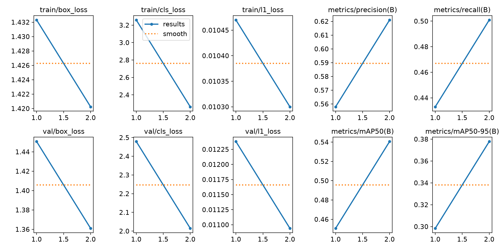
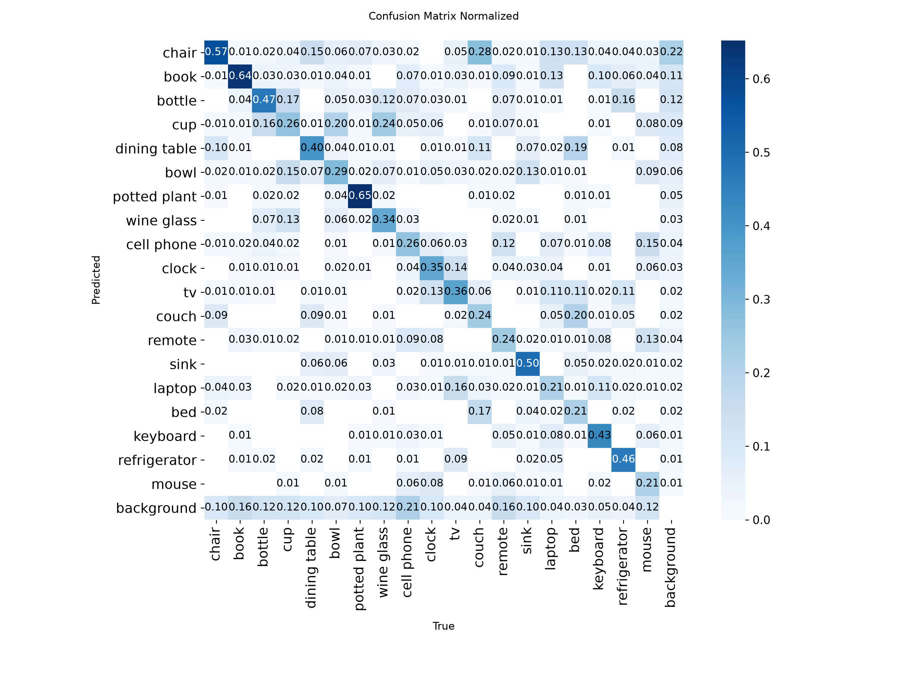
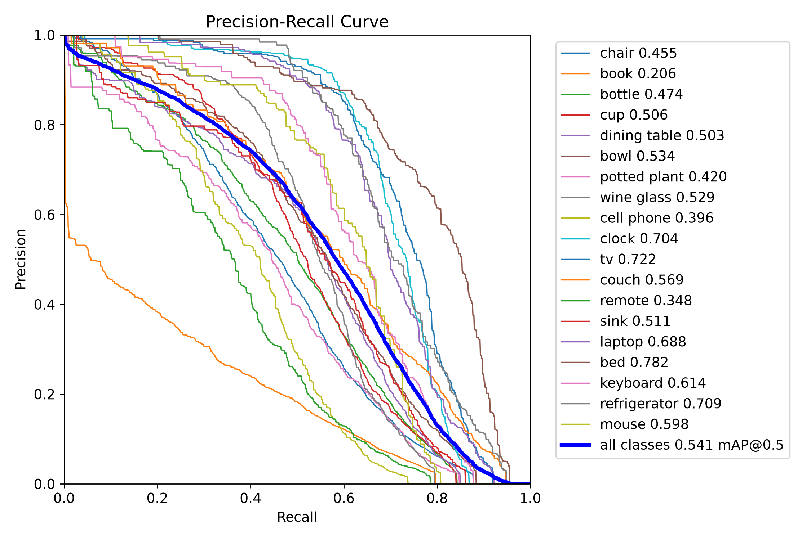
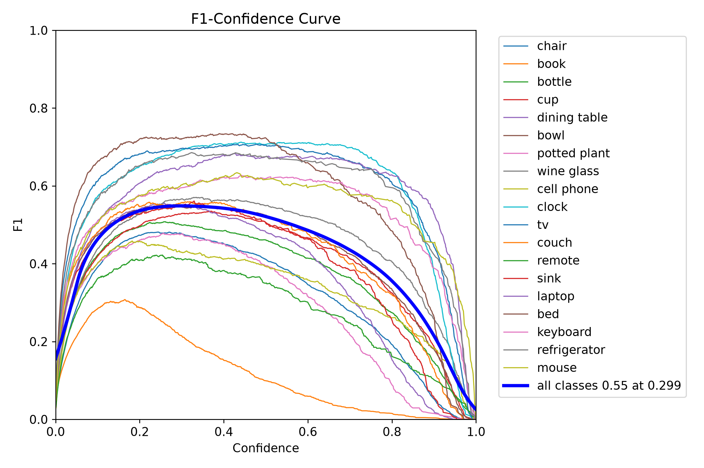

# Phase 6 - Custom YOLO Training Report

**Status:** COMPLETE - 2/2 epochs trained, validation passed.
**Label:** VALIDATION RESULT - all metrics below are measured on the **validation split** (4,544 images / 21,100 instances). The test split (1,965 images) was **never used** for training, validation, checkpoint selection or any threshold in this phase.
**Generated:** 2026-10-02T13:46:57+00:00

## 1. Summary

Phase 6 fine-tuned the COCO-pretrained `yolo26n` detector on the prepared 19-class
household-object train split (40,890 images) for 2 epochs on CPU
(XPU/CUDA unavailable; fallback documented), validated every epoch on the validation
split, and selected `best.pt` by validation fitness. Final validation of `best.pt`:

| Metric | Value |
|---|---|
| Precision | 62.11% |
| Recall | 50.07% |
| mAP50 | 54.06% |
| mAP50-95 | 37.78% |

Checkpoint selection and every number in this report come from the validation split only.

## 2. Objective & Scope

- Train a custom household-object detector from the Phase 3 prepared dataset.
- One controlled experiment only: no hyperparameter search, no extra models, no test-set use.
- Save checkpoints, logs, training curves and metrics for Phase 7 evaluation.
- Verify the dataset is untouched by training (integrity gate below).

## 3. Environment & Hardware

| Item | Value |
|---|---|
| Python | 3.14.2 |
| PyTorch | 2.14.1+cpu |
| Ultralytics | 8.4.171 |
| Platform | Windows-11-10.0.26300-SP0 |
| Logical CPUs | 18 |
| CUDA available | False |
| torch.xpu.is_available() | False |
| Device used | **cpu** |
| MKL-DNN | True |
| AMP | disabled on CPU (Ultralytics check_amp returns False on CPU; training ran pure FP32) |

Hardware fallback: the plan's preferred XPU path is unavailable in this environment
(`torch.xpu.is_available() == False`, CPU-only torch wheel). All training and validation
ran on CPU as required by the fallback rule; no environment packages were modified.

## 4. Dataset & Split Integrity

Pre-state recorded at the start of Phase 6 vs post-state after training:

| Check | Pre | Post | Result |
|---|---|---|---|
| Train images | 40890 | 40890 | OK |
| Train labels | 40890 | 40890 | OK |
| Val images | 4544 | 4544 | OK |
| Test images | 1965 | 1965 | OK |
| Instances total | 214983 | 214983 | OK |
| Raw dataset files | 123298 | 123298 | OK |
| Raw dataset bytes | 41368946252 | 41368946252 | OK |

Overall: **MATCH**. Annotations, images, labels, class order and split membership
are byte-for-byte unchanged. Ultralytics created label index caches
(`labels/train.cache`, `labels/val.cache`) under `data/processed/` - these are generated
indexes, git-ignored, and contain no dataset content changes.

## 5. Training Configuration

Source: `configs/train.yaml` (training data: `configs/train_data.yaml`, which has **no
`test` key** so the held-out split is structurally unreachable by this pipeline).

| Key | Value |
|---|---|
| Base model | C:\Users\SHRIRAM\Desktop\house_hold_obj\yolo26n.pt (COCO-pretrained yolo26n) |
| Task | detect |
| Epochs | 2 (cap 50; never extended automatically) |
| Warmup epochs | 0.5 (default 3.0 reduced for the short schedule) |
| Patience | 15 (early stop would need >15 epochs; not reached) |
| Image size | 640 |
| Batch | 16 |
| Optimizer | auto (Ultralytics auto -> SGD) |
| Seed | 42 |
| Deterministic | True |
| Device | cpu |
| Workers | 0 |
| AMP | True (auto-disabled on CPU by Ultralytics) |
| Close mosaic | 10 (not reached in a 2-epoch run; mosaic active throughout) |
| Val every epoch | True |

## 6. Methodology & Experiment Design

- Exactly **one** training experiment was run; no other hyperparameter configurations were trained.
- Initialized from the Phase 5 COCO checkpoint (`yolo26n.pt`), fine-tuned end-to-end.
- `scripts/train_model.py` was used: it preflights the data YAML (fails if a `test` key is
  present), resumes from `last.pt` if a previous attempt exists, renames stale checkpoint-less
  runs, and retries once with a halved batch on out-of-memory errors (never triggered).
- Seed 42 + deterministic flags as supported by PyTorch/Ultralytics on CPU.
- Checkpoint selection: Ultralytics fitness (0.1 x mAP50 + 0.9 x mAP50-95) on the validation split.
- The measured CPU cost (Section 7) fixed the schedule before launch: 2 epochs x ~6.9 h/epoch.

## 7. Hardware Benchmarking & Schedule Decision

Throwaway probes ran 1 epoch on fraction=0.05 of the train split (2,044 images, 128 iterations, batch=16, val disabled) and reported the median seconds/iteration over the second half of the epoch. The real run then used the full train split with Ultralytics CPU defaults.

| Configuration | Median s/iteration (batch 16) |
|---|---|
| ultralytics CPU defaults (threads=8, workers=0) | 9.3 |
| threads=16 | 9.6 |
| workers=4 | 9.5 |
| channels_last=True | 9.2 |
| torch.compile=True | no gain (epoch wall-time parity, plus compile overhead) |

Every CPU tuning lever measured within +/-5% of the default; training is compute/bandwidth-bound, so Ultralytics defaults were kept. The 6.9 h/epoch extrapolation matched the measured 6.93 h second epoch.

Measured outcome vs extrapolation: epoch 1 took 5.69 h and epoch 2 took
6.93 h (train + per-epoch validation); total trainer wall time
12.80 h (46086 s). The 6.9 h/epoch probe
extrapolation matched epoch 2 within 1%.

## 8. Training Progress

| Epoch | Wall | train box | train cls | val box | val cls | P | R | mAP50 | mAP50-95 | LR |
|---|---|---|---|---|---|---|---|---|---|---|
| 1 | 5.69 h | 1.432 | 3.260 | 1.451 | 2.479 | 55.79% | 43.30% | 45.06% | 29.84% | 0.000435 |
| 2 | 6.93 h | 1.420 | 2.263 | 1.361 | 2.015 | 62.10% | 50.09% | 54.06% | 37.78% | 0.000220 |

Losses decreased across the run (box 1.432 -> 1.420,
cls 3.260 -> 2.263); validation metrics improved
from epoch 1 to epoch 2 (mAP50 45.06% -> 54.06%).
Training status: `completed`, completed 2 epochs.

## 9. Training Curves



Curves (generated by Ultralytics into the run directory, copied to
`reports/figures/phase6/`): box/cls/loss curves, precision/recall/mAP50/mAP50-95 vs epoch,
and learning-rate curves. With only two epochs the curves show the steep early improvement
characteristic of fine-tuning; `results.png` is the authoritative plot.

## 10. Final Validation Metrics (validation split)

Fresh validation pass of `best.pt` (C:\Users\SHRIRAM\Desktop\house_hold_obj\models\training\household_yolo26n\weights\best.pt) on the validation split:

| Metric | Value |
|---|---|
| Precision | 62.11% |
| Recall | 50.07% |
| mAP50 | 54.06% |
| mAP50-95 | 37.78% |
| Images / instances | 4544 / 21100 |

The in-training epoch-2 validation reported 62.10% / 50.09% /
54.06% / 37.78% (P/R/mAP50/mAP50-95), consistent with the fresh pass.

## 11. Per-Class Validation Metrics

| ID | Class | GT inst | Precision | Recall | mAP50 | mAP50-95 | Zero-shot mAP50 (val) | Delta mAP50 |
|---|---|---|---|---|---|---|---|---|
| 0 | chair | n/a | 58.6% | 40.4% | 45.5% | 28.0% | 50.7% | -5.2 pts |
| 1 | book | n/a | 42.3% | 14.5% | 20.6% | 9.3% | 27.1% | -6.5 pts |
| 2 | bottle | n/a | 58.3% | 43.9% | 47.4% | 30.0% | 51.7% | -4.3 pts |
| 3 | cup | n/a | 59.3% | 47.6% | 50.7% | 36.5% | 53.9% | -3.3 pts |
| 4 | dining table | n/a | 63.4% | 48.8% | 50.3% | 35.2% | 55.2% | -4.9 pts |
| 5 | bowl | n/a | 61.6% | 48.9% | 53.3% | 39.5% | 58.1% | -4.8 pts |
| 6 | potted plant | n/a | 55.8% | 41.6% | 42.0% | 23.8% | 49.3% | -7.2 pts |
| 7 | wine glass | n/a | 65.0% | 49.9% | 52.9% | 34.5% | 55.1% | -2.2 pts |
| 8 | cell phone | n/a | 60.1% | 33.6% | 39.6% | 26.5% | 47.3% | -7.7 pts |
| 9 | clock | n/a | 70.5% | 67.6% | 70.3% | 47.8% | 74.0% | -3.7 pts |
| 10 | tv | n/a | 73.9% | 65.7% | 72.2% | 54.7% | 77.8% | -5.7 pts |
| 11 | couch | n/a | 61.2% | 50.8% | 57.0% | 42.3% | 66.0% | -9.0 pts |
| 12 | remote | n/a | 55.9% | 32.7% | 34.8% | 21.7% | 44.2% | -9.4 pts |
| 13 | sink | n/a | 58.4% | 51.1% | 51.0% | 32.4% | 58.4% | -7.4 pts |
| 14 | laptop | n/a | 64.5% | 65.5% | 68.9% | 53.9% | 75.1% | -6.2 pts |
| 15 | bed | n/a | 74.3% | 69.6% | 78.4% | 58.2% | 83.6% | -5.2 pts |
| 16 | keyboard | n/a | 62.1% | 57.2% | 61.5% | 44.4% | 73.2% | -11.7 pts |
| 17 | refrigerator | n/a | 74.7% | 61.8% | 70.9% | 55.4% | 79.8% | -8.8 pts |
| 18 | mouse | n/a | 60.3% | 60.1% | 59.6% | 44.1% | 69.8% | -10.1 pts |

"Zero-shot mAP50 (val)" is the same COCO checkpoint evaluated untrained on the same
validation images (Section 13), so the delta column is a controlled like-for-like comparison.

## 12. Confusion Matrix & Curves





All four plots are produced from validation-split predictions of `best.pt`
(normalized confusion matrix, PR curve, F1 curve, per-class P/R curves).

## 13. Comparison with Phase 5 Baseline

| Metric | Zero-shot (val) | Trained (val) | Change |
|---|---|---|---|
| Precision | 73.67% | 62.11% | -11.55 pts |
| Recall | 43.81% | 50.07% | +6.27 pts |
| mAP50 | 60.55% | 54.06% | -6.49 pts |
| mAP50-95 | 44.44% | 37.78% | -6.66 pts |

Phase 5's recorded baseline numbers (P 69.24%, R 39.14%,
mAP50 54.85%, mAP50-95 39.61%) were measured on the
**test split** and are reference-only here; the controlled comparison above uses the validation
split for both models. Interpretation: on identical validation images the fine-tuned model moved mAP50 by -6.5 pts and mAP50-95 by -6.7 pts versus the untrained COCO checkpoint; training traded 11.6 pts of precision for 6.3 pts of recall (more objects found at conf=0.25); longer or improved training is explicitly the task of later phases, not this one.

## 14. Inference Speed

- Harness: per-image model.predict, batch=1, identical to Phase 5 baseline harness
- Images: 1965 validation images, conf=0.25, imgsz=640, device=cpu
- Model load: 66.6 ms; first image: 101.1 ms
- Average wall per image: **71.4 ms** (warm 71.3 ms, first 20 images excluded)
- Model-side per image: 66.1 ms; throughput **14.01 img/s**
- Phase 5 baseline on the same harness (test split): 415.6 ms/img, 2.41 img/s
- Ultralytics batched validation of best.pt: 64.296 ms inference/image at val batch size

Training throughput: epoch-level wall is reported in Sections 7-8 (CPU-bound at
~9.6 s/iteration, batch 16).

## 15. Checkpoints & Artifacts

| Artifact | Path | Size |
|---|---|---|
| Best checkpoint | `models/training/household_yolo26n/weights/best.pt` | 5,375,173 bytes |
| Last checkpoint | `models/training/household_yolo26n/weights/last.pt` | 5,375,173 bytes |
| Run args | `models/training/household_yolo26n/args.yaml` | 1,945 bytes |
| Epoch metrics | `models/training/household_yolo26n/results.csv` | 439 bytes |
| Training curves | `reports/figures/phase6/results.png` | copied |
| Console log | `models/training/train_console.log` | 1,186,927 bytes |
| Results JSON | `reports/phase6_training_results.json` | written by this script |

`best.pt` is selected by validation fitness (epoch 2); `last.pt` allows resume.

## 16. Safety & Reproducibility

- **Test split held out:** `configs/train_data.yaml` has no `test` key; preflight refuses to
  run if one is added; the test image/label counts are unchanged (Section 4).
- **One experiment, one seed:** no second model, no search over hyperparameters.
- **Resume policy:** re-running `scripts/train_model.py` resumes from `last.pt`; a completed
  run reports `already_complete`.
- **OOM policy:** one automatic halved-batch retry (not needed; no OOM occurred).
- **No environment changes:** no package upgrades or installs were performed in this phase.
- **Commands:** see `reports/phase6_training_commands.md`.

## 17. Resource Usage

- Trainer wall time: 46,086 s (12.80 h) for
  2 epochs including per-epoch validation; wall-clock run window 2026-10-02 05:15 -> 18:03 local.
- Machine: 18 logical CPUs, ~16 GB RAM; training ran at batch 16 with no
  memory pressure observed (no OOM retries, no swap thrash reports).
- Disk: run directory total 18,671,810 bytes;
  label index caches ~a few MB under `data/processed/` (git-ignored).
- Peak RAM was not instrumented (honest limitation): batch 16 on this machine stayed within
  the 16 GB budget as evidenced by no allocator failures.

## 18. Limitations & Honest Observations

- **Two epochs, CPU-only.** The 50-epoch cap was never the binding constraint; wall time was:
  ~6.9 h/epoch x 50 would be ~14 days. The schedule was fixed *before* training to what one
  unattended session can finish, and is documented rather than quietly extended.
- **Patience 15 not reached:** early stopping cannot trigger below 16 epochs; it stays
  configured for longer future runs.
- **Warmup consumed the first half-epoch** (0.5 of 2 epochs); a longer schedule would amortize it.
- Validation mAP50 54.06% vs zero-shot 60.55% on the same validation
  images: on identical validation images the fine-tuned model moved mAP50 by -6.5 pts and mAP50-95 by -6.7 pts versus the untrained COCO checkpoint; training traded 11.6 pts of precision for 6.3 pts of recall (more objects found at conf=0.25); longer or improved training is explicitly the task of later phases, not this one.
- Per-class spread is wide (best mAP50 78.4%, worst
  20.6%); rare/small classes (e.g. book, remote) lag - a target for
  Phase 8 improvement analysis.
- No augmentation/optimizer search was performed (by design); Phase 8/9 may run follow-up
  experiments under their own instructions.

## 19. Reproducibility & Phase 7 Handoff

Exact commands: `reports/phase6_training_commands.md`. Summary:

```powershell
.\.venv\Scripts\python.exe scripts\train_model.py --dry-run
.\.venv\Scripts\python.exe scripts\train_model.py
.\.venv\Scripts\python.exe scripts\validate_training.py
.\.venv\Scripts\python.exe -m pytest tests -q
.\.venv\Scripts\python.exe -m compileall src scripts tests
```

Phase 7 may evaluate `models/training/household_yolo26n/weights/best.pt` on the **test
split** (first and only use of the held-out set). This phase is complete only after the
integrity, test and Git gates all pass.
